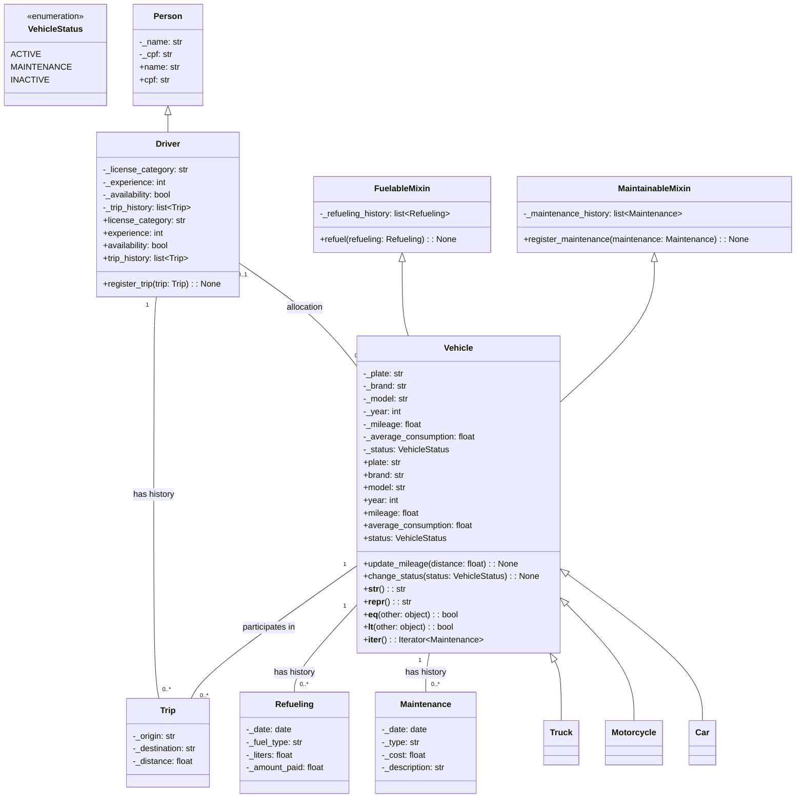

# Vehicle Fleet Management System (vfms)

## Summary
- [Description](#description)

- [Objective](#objective)

- [Class Structure](#class-structure)

- [File Structure](#file-structure)

## Description
The vfms project is a cli program writted in python - using the oriented object programming paradigm - that allows organizations to manage they vehicle fleet.

## Objective
Learn how to use OOP and create a functional program.

## UML 


## File Structure

```bash
vfms
│
├── pyproject.toml
├── README.md
├── src
│   └── vfms
│       ├── classes
│       │   ├── car.py
│       │   ├── driver.py
│       │   ├── maintenece_mixin.py
│       │   ├── maintenence.py
│       │   ├── motorcicle.py
│       │   ├── person.py
│       │   ├── refuel_mixin.py
│       │   ├── refuel.py
│       │   ├── trip.py
│       │   ├── truck.py
│       │   ├── vehicle.py
│       │   └── vehicle_status.py
│       ├── __init__.py
│       └── settings.json
└── uv.lock

```


