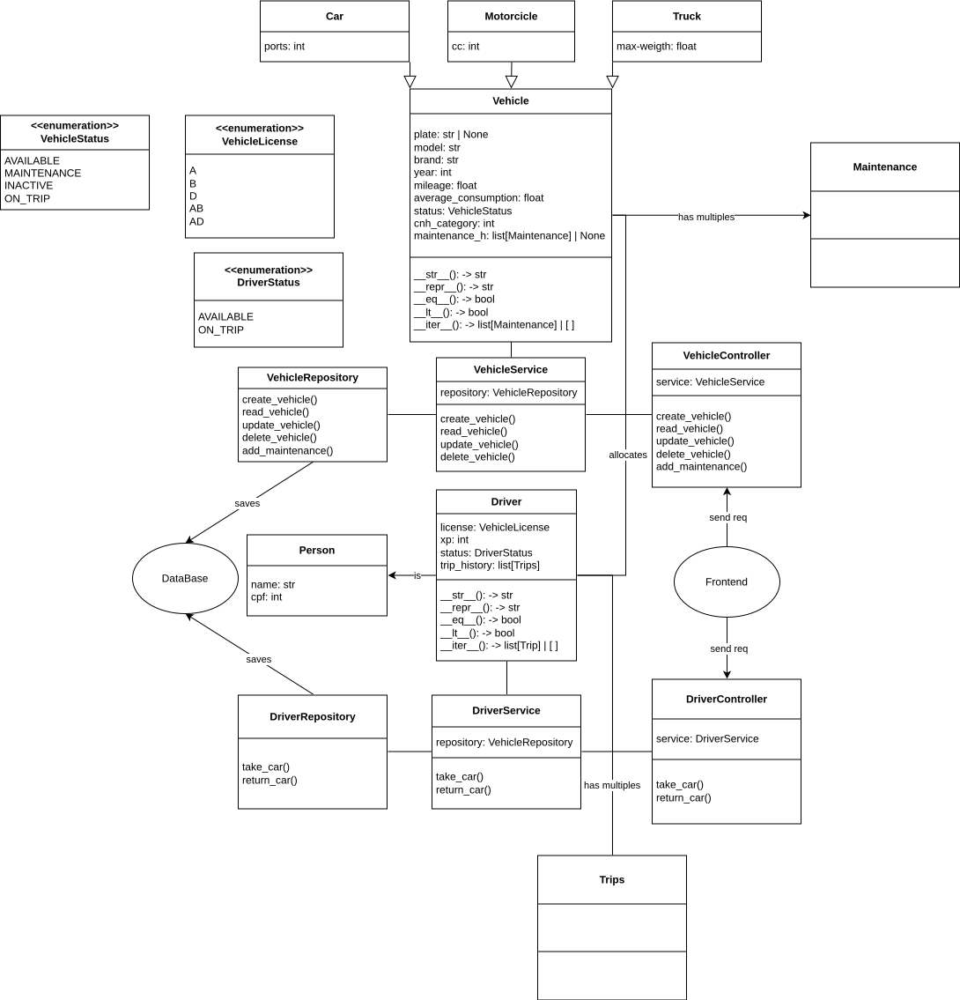

# Vehicle Fleet Management System (vfms)

## Summary
- [Description](#description)

- [Objective](#objective)

- [UML](#uml)

- [File Structure](#file-structure)

## Description
The vfms project is a cli program writted in python - using the oriented object programming paradigm - that allows organizations to manage they vehicle fleet.

## Objective
Learn how to use OOP and create a functional program.

## UML 

## File Structure

...

